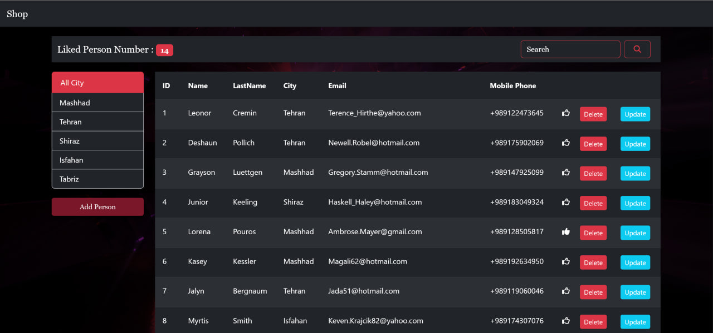
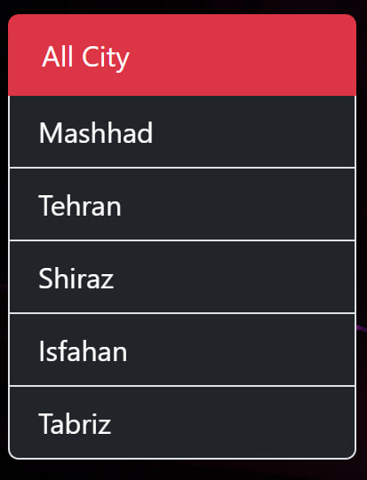
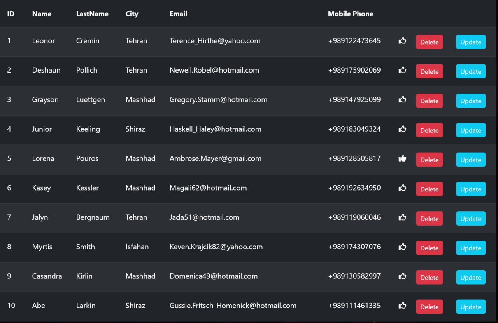

# CRUD Operation for Persones using react

This project was bootstrapped with [Create React App](https://github.com/facebook/create-react-app).

## src Folder

        ---Persones
        ---Navbar
        ---Login
        ---Update
        ---NotFound
        ---Paging_Navbar

---

### in Short

The base of the Project has been implemented in persone Folder. In this folder, we can see a table that has a header for the Properties of each person and we can sort them with click on each property. in the table, we can delete each person & update it and also give a like to each person. we also have a navigation bar that shows the number of persons that we like and also a search bar for searching. On this page, we have a list group that filtered each person with their (city) properties. we have a button for adding a new person that navigates us to the login page and we should add a valid person to our list. we have a pagination that navigates us to each page of our list. we have a button for showing all persons that we have on our list.

## Login

i create components for this project we use class component and also functional component.
in Login folder i create [form.jsx](./src/components/login/form.jsx) and [input.jsx](./src/components/login/input.jsx) for using them in [login.jsx](./src/components/login/login.jsx) and [update.jsx](./src/components/login/update.jsx) .in form component we create functions for validate our data and also we craete a function for validate our form and handle submit ,change and render input.i extract each input in input component and use it in form component.also i create select component for using it in form component. then in addition to using bootstrap for styling, i use css for styling when hovering over the input and also when the input is invalid. in Login.jsx i place the forms and use the functions that i create in form component.

## Persones

in persones folder we have table ,list group,Navigation bar and pagination component.in List group component we create a list group, show us the cities that we have in our list and we can filter our list with click on each city.in table component we create a table, show us the persons that we have in our list and we can sort them with click on each property of person , also we can delete each person and update it . also give a like to each person .in Navigation bar component we create a navigation bar that show us the number of persons that we like and also a search bar for searching .in pagination component we create a pagination that navigate us to each page of our list.also we have a button for adding a new person that navigates us to the login page and we should add a valid person to our list.

below we see the Person page and the components that we have in this page.

#### list group

#### table

#### navigation bar

#### pagination

#### add person

https://github.com/Mohammad-Sobhan-Saririan/persones/assets/101567856/39686084-28e9-473d-b237-a2ba07f1cbeb

#### Full video

https://github.com/Mohammad-Sobhan-Saririan/persones/assets/101567856/c3c5c593-d475-4b86-b2b2-82108adf8bbe

### packeges

    -lodash
    -fontawesome
    -bootstrap

<!-- Update README.md -->
